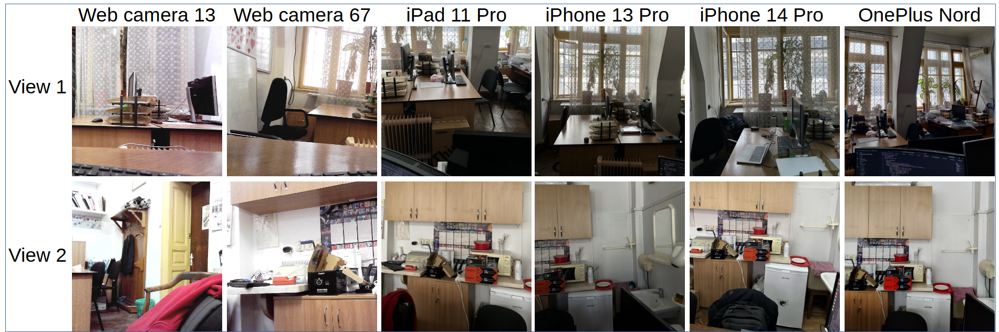

# PRNU-Bench: A Novel Benchmark and Model for PRNU-Based Camera Identification



Due to size limitations we couldn't share the full dataset without violating the blind review policies. However, we share a much smaller subset at the following link:

https://drive.google.com/drive/folders/1s3DTGCddpjjJP5nHGEyZE9sEv3OI4gFx?usp=sharing

!!! We underline that we will make the entire dataset public if the article is accepted.

### Environment
Create a conda environmet with python 3.9 installed and install the dependencies from requirements.txt
```
conda create -n prnu python=3.9
conda activate prnu
pip install -r requirements.txt
```
### PRNU fingerprint extraction for the pre-training phase

1. Ensure that in config/config.json the paths are correct.
2. Run:
```
python prnu_extraction_train.py
```

### Run the training of the neural-based comparison methods.
```
python train.py --resolution <1400/1024> --prnu_signals_path <path to the previously extracted fingerprints> --query_training_path <path to the previously extracted noise residuals>
```

### Run fingerprint and noise residual extraction for the evaluation phase
```
python prnu_extraction_test.py
```

### Evaluation
By default, the parameters for evaluation should be the following:
```
python test.py --prnu_signals_path test_registered_devices/ --query_path queries --ckpt_paths trained_models/resnet50_1024_30.pt,trained_models/resnet50_1400_30.pt
```
