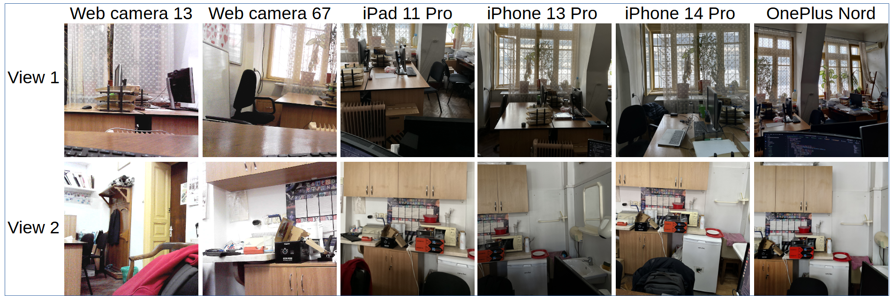

# PRNU-Bench: A Novel Benchmark and Model for PRNU-Based Camera Identification




### Dataset 
In our experiments, we used the PRNU-Bench dataset which is shared here:

https://huggingface.co/datasets/unibuc-cs/PRNU

If you want to use this dataset, you can clone it with:
```
git lfs install
GIT_LFS_SKIP_SMUDGE=0 git clone https://huggingface.co/datasets/unibuc-cs/PRNU
```
### Environment
Create a conda environmet with python 3.9 and install the dependencies from requirements.txt:
```
conda create -n prnu python=3.9
conda activate prnu
pip install torch==2.3.1 torchvision==0.18.1 torchaudio==2.3.1 --index-url https://download.pytorch.org/whl/cu118
pip install -r requirements.txt
```
### Models
We share the models that we used in our experiments, here:
```
git lfs install
GIT_LFS_SKIP_SMUDGE=0 git clone https://huggingface.co/acroitoru/PRNU-Bench
```
## Device Registration
We created a script to evaluate PRNU-based device identification performance on a specific set of devices. The following section outlines the procedure for device registration and the subsequent comparison process for a set of query images.

### 1. Device Registration.

To register a new device, execute the ```register_device.py``` script. The script accepts two parameters:

```--input_path```: Specifies the source directory. This can be a folder containing images for a single device, or a root directory containing subfolders for multiple devices. The device name is derived from the folder or subfolder name.

```--register_multiple_devices```: A flag required when the input_path contains subfolders (i.e., when registering a batch of devices).

Example of usage for a single device:
```
python ./register_device.py --input_path ../datasets/prnu_ds/camera_1
```

Example of usage for multiple devices:
```
python ./register_device.py --input_path ../datasets/prnu_ds/ --register_multiple_devices
```
Important: Few other configurations are stored in ```configs/configs.json```. For example ```no_samples_prnu_estimation``` controls how many images will be used in PRNU estimation(performance-wise more is better, but the processing time increases). By default, the value is set to 5. To deactivate this number and to use the entire set of images, you can pass ```-1```.

After the registration is complete the PRNU signals will be saved at the path specified in ```output_prnu_fingerprint``` which is also in ```configs/configs.json```.

### 2. Device comparison
   
After registering your devices, you can compare the noise residuals of new images against your saved PRNU fingerprints using the ```comparison.py``` script.

Parameters:

```--device_list``` (Optional): Specify a subset of registered devices to compare against. If omitted, the script compares against all saved devices.

```--input_path```: The file path to the input images. This accepts two directory structures:

1) A single folder containing images.

2) A root folder containing subfolders, where each subfolder represents a specific device.

```--infer_device_id```: Use this flag when using the subfolder structure (structure #2 above). It treats the subfolder names as ground truth device IDs to enable performance metric computation.

Examples:
The following command assumes the ```--input_path``` is organized into device-specific subfolders. It limits the comparison scope, matching images only against the PRNU fingerprints for ```camera_2``` and ```camera_4```:
```
python comparison.py --infer_device_id --input_path ../datasets/test_prnu/ --device_list camera_2,camera_4
```

The following command will search for images directly in ```--input_path```, which is expected to be in the first directory structure. And it will compare the images against all the available PRNU fingerprints:
```
python comparison.py  --input_path ../datasets/test_prnu/camera_2/
```

The results of the script will be saved in ```result.json```.

## Evaluation on PRNU-Bench
Update, if necessary, the paths in ```configs/config.json```.
### Run fingerprint and noise residual extraction for the evaluation phase
```
python prnu_extraction_test.py
```
### Evaluation
By default, the parameters for evaluation should be the following:
```
python test.py --prnu_signals_path test_registered_devices/ --query_path queries --ckpt_paths checkpoints/model_1024.pt,checkpoints/model_1400.pt
```
The previous command will compute the performance stats.

## Training (Optional: only if you want to train your own comparison model)
The scripts are configured to work with the format of PRNU-Bench
### PRNU fingerprint extraction for the pre-training phase

1. Ensure that in config/config.json the paths are correct.
2. Run:
```
python prnu_extraction_train.py
```

### Run the training of the neural-based comparison methods.
```
python train.py --resolution <1400/1024> --prnu_signals_path <path to the previously extracted fingerprints> --query_training_path <path to the previously extracted noise residuals>
```
